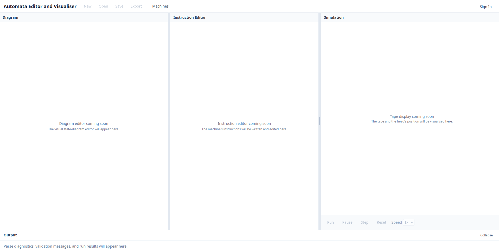

# UI Design

The Automata Editor uses a three-pane layout for its main editor interface.

{ loading=lazy }

The application interface consists of three resizable panes:

- **Diagram Pane** — An interactive state diagram editor for visually constructing and manipulating Turing Machine transition graphs.
- **Instruction Editor Pane** — A text-based code editor for defining machine instructions using the automata definition language.
- **Simulation Pane** — A computation visualiser with animated tape movement for executing and stepping through machine computations.

The panes are resizable, allowing users to adjust the layout to their workflow.

---

**AI Declaration:** The preceding document was generated with the assistance of: Qoder IDE [auto].
