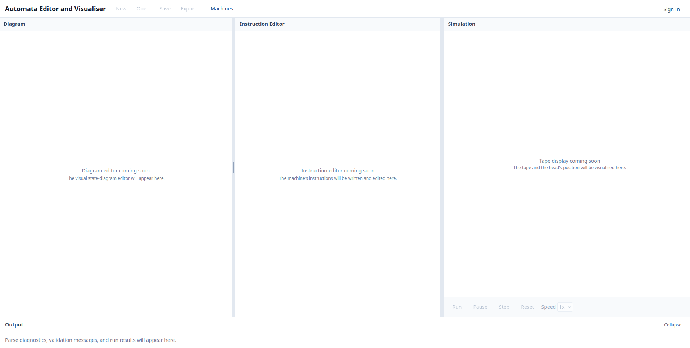

# UI Design

The editor is laid out around what you do with a machine: **build** it in the diagram and the instructions, **run** it on the tape, **test** it against expected outcomes, and check **how it went**. Each of those has one place on the screen, and it stays there. This layout shipped in sprint 3 (Frontend #85, #86).

{ loading=lazy }

The mockup above is the original three-pane design from sprint 1. The sections below describe the editor as it is now.

---

## On a Desktop

| Area | Where | What it holds |
|---|---|---|
| **Diagram** and **Instruction Editor** | The centre | The two views of the machine, kept in sync. They get most of the screen. |
| **Simulation** | Along the bottom, under the editors | The input, the playback controls, the speed, and the tape across the full width. For a nondeterministic machine, the computation tree instead. |
| **Side bar** | The right edge | One of two views at a time: **Test cases** or **Machine** (the tape count, the Nondeterministic setting, and both alphabets). |
| **Status bar** | Along the very bottom | Whether the instructions parse, and how the last check of the test cases went. |
| **Navigation bar** | Along the top | Home, the document actions (New, Save, Revert, Share, Export), the machine's name, colour mode, and signing in. |

### Arranging the Editors

A switch at the **top right of the editors** shows them **side by side**, **stacked**, the **diagram only**, or the **code only**. It is in the same place whichever you choose. **Reset layout** sits next to it, set apart by a thin line, and puts every area back to its default.

### The Side Bar

The **activity bar** down the right edge has an icon for each side bar view: a gear for **Machine** and a beaker for **Test cases**. Choosing an icon opens its view. Choosing the open view's icon again closes the side bar, and the editors and the simulation take the room. Both views keep their state while hidden, so a half-written test case is still there after a look at the machine settings.

### The Simulation Panel

- The panel's header collapses it to a single line. While collapsed, the header has a **Run** button that opens the panel and starts the run.
- **Opening a test case in the simulator** opens the panel, loads that case's input, and puts the cursor in it.
- A nondeterministic machine gets a taller panel, with the computation tree on the left and the selected branch beside it. The two heights are remembered separately.

### The Status Bar

- **Errors in the instructions**: "No errors", or a count such as "2 errors". Choosing the count jumps to the first error in the instruction editor, and brings the editor back into view if it was hidden.
- **The last check of the test cases**: progress while a check runs, then the totals, for example "3 passed · 1 failed · 0 inconclusive". Choosing them opens the Test cases view.

### Resizing and Keyboard Use

The line between the editors, the top edge of the Simulation panel, and the left edge of the side bar can each be dragged. Each is also keyboard focusable and moves with the arrow keys. Every control has a name a screen reader can read out, and icon-only buttons show their name in a tooltip on hover or keyboard focus.

### What Is Remembered

The arrangement, the sizes, which side bar view is open, and whether the Simulation panel is collapsed are kept in this browser, so the editor opens the way you left it. Reset layout returns to the default: side by side, the Test cases view open, and the Simulation panel open.

## On a Phone

A phone has no room to show several areas at once, so the editor shows **one view at a time** (below 768px wide):

- A **tab bar** along the bottom switches between **Diagram**, **Code**, **Run**, **Tests** and **Machine**. The status bar sits just above it.
- The **menu** button in the navigation bar opens a list over the page: the machine's name, then Home, New, Save, Share and Export, each with its name in words, and colour mode and signing in at the bottom. An action that is unavailable says why under its name. Choosing an action, pressing Escape, or tapping outside closes the menu.
- The first time the editor opens on a phone, a notice says it **works best on a bigger screen** and can still be used there. It blocks nothing, and once dismissed it stays away in that browser.

---

## Accessibility

The editor is built to be usable without a mouse and by assistive technology.

### Semantic markup

Every interactive element is a real HTML control — `<button>`, `<input>`, `<select>`, `<dialog>` — not a styled `
`. Landmarks use their proper roles: the navigation bar is `<nav aria-label="Main">`, page sections use `<section aria-labelledby>`, and dialogs use the native `<dialog>` element.

### Accessible names

Every control has a name a screen reader can announce. Icon-only buttons (the activity bar, the layout switch, the toolbar actions) carry an `aria-label` and show a tooltip on hover or keyboard focus. Toggle buttons expose their state through `aria-pressed`. Form fields that fail validation are marked `aria-invalid`.

### Keyboard access

- All actions reachable by mouse are reachable by keyboard.
- Panel resizers are focusable and move with the arrow keys.
- Dialogs trap focus while open and return it to the triggering element on close.
- The help dialog's topic list uses roving `tabIndex` with arrow-key navigation.
- A shared `focusRing` style (`focus-visible:outline focus-visible:outline-2 focus-visible:outline-offset-2 focus-visible:outline-blue-600`) is applied to every interactive component, so focus is always visible without affecting mouse users.

### Live regions

- Errors and destructive-action confirmations use `role="alert"` so they are announced immediately.
- Loading indicators use `role="status"` with `aria-live="polite"` so they are announced when convenient.
- The status bar's parse-error count and test-result totals update in place without stealing focus.

### Contrast

The colour tokens are chosen so that all text a user needs to read meets WCAG AA contrast in both light and dark mode. The one token below AA (`--fg-faint`) is reserved for disabled controls and decoration, never for readable text.

### Testing

Component and route tests query the DOM by accessible role (`getByRole`, `findByRole`) rather than by CSS selector or test ID. This means a missing or incorrect accessible name fails the test suite.

---

## Visual Design System

The editor uses a consistent, token-driven design system rather than ad-hoc styling.

### Colour tokens

All colours are defined as CSS custom properties in `index.css` and consumed through Tailwind utilities (`bg-surface`, `border-line`, `text-fg-muted`). The tokens are named by role, not by shade:

| Token family | Shades | Used for |
|---|---|---|
| `surface` | 5 (base, muted, sunken, strong, stronger) | Backgrounds, cards, raised areas |
| `line` | 4 (subtle, base, strong, stronger) | Borders, dividers, panel edges |
| `fg` | 5 (base, secondary, muted, subtle, faint) | Text at decreasing emphasis |
| `backdrop` | 1 | Dialog and menu overlays |
| `tooltip` | 1 | Tooltip backgrounds |

Each token resolves to a different value in light and dark mode, so a component written against the tokens needs no `dark:` variant of its own. Accent colours (emerald for accept, rose for reject, amber for warning, sky for actions) come from Tailwind's palette and carry an explicit `dark:` variant where the light shade would be unreadable on a dark background.

### Light and dark mode

The theme is controlled by a `.dark` class on `<html>`, set by `theme.ts`. Users choose Light, Dark, or System; the choice persists across sessions. The diagram canvas exports in light mode regardless of the current theme, so shared images look consistent.

### Typography and icons

- Text uses the system font stack (Roboto on the documentation site, system-ui in the app).
- Code uses Roboto Mono / the system monospace stack.
- Icons are VS Code codicons, giving a uniform weight and style across every button and menu item.

### Component consistency

Interactive elements share a single `button-styles.ts` module that exports the focus ring, size variants, and colour treatments. The `IconButton` component wraps every icon-only button with a consistent shape, hover state, disabled state, and accessible name requirement. Dialogs, menus, and panels all draw their borders, backgrounds, and shadows from the same token set.

### Diagram theming

React Flow's built-in variables (`--xy-background-color`, `--xy-edge-label-background-color`, `--xy-controls-button-*`) are overridden from the same CSS custom properties, so the diagram canvas, zoom controls, and edge labels follow the app theme without separate styling.

---

## Responsiveness

The editor is desktop-first but adapts to smaller viewports using Tailwind's responsive prefixes.

### Breakpoints

| Prefix | Width | Behaviour |
|---|---|---|
| (none) | < 640px | Single-column layouts, stacked panels, mobile navigation |
| `sm:` | >= 640px | Two-column grids in dialogs and card lists |
| `md:` | >= 768px | Full desktop layout: side-by-side editors, persistent nav bar, side bar |
| `lg:` | >= 1024px | Three-column machine card grid on the home page |

### Desktop (>= 768px)

The navigation bar uses a three-column grid (`md:grid md:grid-cols-[minmax(max-content,1fr)_minmax(0,auto)_minmax(max-content,1fr)]`) so the machine name stays centred while actions fill the edges. The editors, side bar, and simulation panel are all visible simultaneously and resizable.

### Tablet and small desktop (640–767px)

Dialogs switch from stacked to side-by-side layouts (`sm:flex-row`). The help dialog's topic list moves from a horizontal scroll to a vertical sidebar (`sm:w-44 sm:flex-col`). Machine cards form a two-column grid (`sm:grid-cols-2`).

### Phone (< 768px)

Below the `md` breakpoint the editor shows one view at a time, controlled by a bottom tab bar (Diagram, Code, Run, Tests, Machine). The navigation bar collapses to a menu button that opens a full-width overlay list. The computation tree pane stacks vertically instead of side by side. A dismissible notice on first visit says the editor works best on a bigger screen.

### Fluid elements

Panel resizers, the simulation tape, and the diagram canvas all adapt to whatever space is available rather than using fixed pixel widths. The tape scrolls horizontally when the input exceeds the viewport.

---

## User Experience Patterns

### Error handling

- **Instruction parse errors** appear inline in the code editor (underlined with a diagnostic message) and as a count in the status bar. Choosing the count jumps to the first error and brings the editor into view if it was hidden.
- **Network and server errors** surface as `role="alert"` banners at the point of failure (sign-in page, home page, editor save) rather than a generic toast, so the user knows which action failed.
- **Form validation** marks invalid fields with `aria-invalid` and shows the specific issue beneath the field. The backend uses Zod schemas; the frontend mirrors the same rules so most errors are caught before a request is sent.
- **Unavailable actions** explain themselves: a disabled button says why in its tooltip and, on the mobile menu, in words under its name.

### Loading and progress

- Every async operation shows a `role="status"` indicator in context: "Loading machines…" on the home page, "Moving to your account…" during a copy, "Loading shared machines…" in the shared tab.
- The simulation panel shows progress while a test-case check runs, then resolves to totals ("3 passed · 1 failed · 0 inconclusive").
- Long-running simulations pause themselves at a configurable step budget rather than freezing the tab.

### Destructive actions

Deleting a machine, revoking a share, or revoking an API key opens a `ConfirmDialog` that names the consequence and requires an explicit confirm. The dialog traps focus and returns it to the trigger on cancel.

### Session persistence

The editor remembers per browser: the layout arrangement (side by side, stacked, diagram only, code only), panel sizes, which side bar view is open, whether the simulation panel is collapsed, and the colour-mode choice. Re-opening a closed tab resumes where the user left off without re-login (Auth0 sessions persist independently).

### Discoverability

- The status bar's test-result totals are clickable and open the Test cases view.
- The activity bar icons show tooltips naming each view.
- Example machines on the home page let a first-time user open a working machine immediately.
- The help dialog (question-mark icon) provides in-app documentation for every feature area.

---

**Related**: [Features Overview](Features/index.md) | [Frontend Architecture](Technical%20Architecture/frontend-architecture.md) | [Simulation & Playback](Features/simulation.md) | [Test Cases](Features/test-cases.md)

---

**AI Declaration:** The preceding document was generated with the assistance of: Qoder IDE [auto], Claude Code [Claude Opus 5.5], Qoder-IDE [Qwen3.8-Max].
